# PubSub Py: AI-Powered, One-Sentence Deli Sub Ordering and Deal Searching Platform for Publix


Publix is a grocery chain in the Southeastern United States; their great sandwiches 
are locally known as "**Pubsubs**". I always order for pickup - it helps out the workers (I would know) and it's convenient to do before
heading out the door. 

#### The ordering process is a pain:
- 10 stages
- Deals are hard to find and they change daily
- Ordering requires a plethora of personal info, none of which is necessary <br>
  *Problems exacerbated on mobile*

#### I made PubSub Py as a text platform to solve these problems:

 - > "Anything good on sale today?" <br> <br>
...0.2 seconds, **BOOM** &darr;
   > > "Looks like the Publix deli lemon garlic aioli baked chicken sub ($8.59) is on sale today."
 
 - > "I want a whole **boar head italiano** sub. I want provolone, some tomatoes, **oion**, spinach, and a bit of that 
   > chipotle sauce. Also salt, pepper, and regular mayo. Put that on the five grain bread and toast it! :)" <br> <br>
...2.6 seconds, **BOOM** &darr;
   > > "Great, your order for the Boar's Head Italian Sub is confirmed for pickup at St. John's Town Center at 1:50 PM
   > today. It'll be ready under the name Wump Flibbertigibbet."
 
#### You can spell stuff wrong, use slang, forget to put a bread option - PubSub Py will understand you.

PubSub Py streamlines the Publix deli sub ordering process by leveraging natural language processing and web scraping 
to empower users to discover local deals and place orders with a single text.

### How can I use this?
- You cannot: this project is a proof-of-concept, not intended for commercial use, and is soley for educational purposes.

### Legal Disclaimer:
This project is an independent proof-of-concept application and is not affiliated with, endorsed by, or supported by Publix Super Markets, Inc. or its subsidiaries. It is solely intended for educational purposes and personal use, and is not intended for commercial use or to bypass any restrictions or policies set forth by Publix. The creator of this project does not claim any ownership over the Publix name, logo, or any proprietary information mentioned or used from Publix.com. PubSub Py may not comply with the Terms of Use and Privacy Policy of Publix.com, and the user assumes all risks and responsibility for any legal consequences that may arise due to the use of this application. The creator of this project is not responsible for any potential violations of Publix.com's Terms of Use, Privacy Policy, or any other legal agreements between the user and Publix. By using this application, you acknowledge and accept these risks and responsibilities, and agree to indemnify and hold harmless the creator of PubSub Py from any liability arising from your use of this application. The creator of this project is open to discussing any concerns with Publix to find a solution that complies with their policies. The creator of this project is open to discussing any concerns with Publix to find a solution that complies with their policies.

## How does it work?
- **Google Maps** API & GeoPy are used for rapid store location lookup 
- The **Publix API** is used to query deals from your local Publix 
- **Twilio** and **Twiml** enable the text platform, working off webhooks
through a **Flask** app in a **Docker** container to send and receive messages
- A **Scikit-learn vectorization** model, the **Open AI API**, and some fuzzy string
matching all work together to accurately parse user orders for customization orders and preferences
- **Selenium** 4 automates the ordering process
- **AWS RDS** securely stores a user's information and remembers it for future orders in a **MySQL** database 

## Flow diagram


To ensure the functionality of both Twilio and Selenium components app components, I've implemented unit tetsts through
 Python's Pytest with Magic Mock and Patch (found in tests/). Currently, I have complete tests for the Twilio Flask app portion of the project, including tests for: user initialization, and start, get_name, get_store_location, get_sale, and default state transitions.

Follow these steps to run the tests:

1. Ensure you are in the root directory of the project and have requirements installed

2. Run the tests
 - Twilio/Twilm Flask app tests:
 
   ```python
   pytest tests/twilio_tests.py
   ```
- Selenium tests:
   ```python
   pytest tests/selenium_tests.py
   ```

The tests will be executed, and you will see the results in your terminal. The tests cover ever function in the Flask app, such as login, registration, file upload, and file validation.


## Contributing

We welcome contributions to this project. Please read the [CONTRIBUTING.md](CONTRIBUTING.md) for more information on how to contribute.

## License

This project is licensed under the MIT License. See the [LICENSE](LICENSE) file for details.

