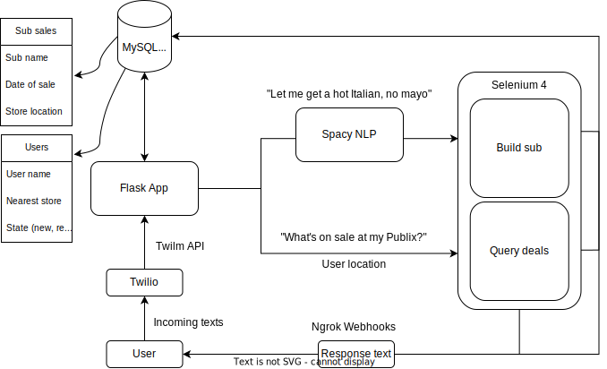

# Pubsub Py: Allowing automated, simple ordering for Publix deli subs through text with natural language processing

**Note: This project is a work in progress.**

Pubsub Py simplifies your Publix deli sub ordering process using natural language processing, allowing you to find deals of your local deli with one text and place an order with another.

Powered by **Selenium 4**, Pubsub Py scrapes your local deli's website daily and keeps you informed through text, courtesy of **Twilio**. Your text responses are cleaned and parsed using **Spacy** natural language processing, enabling one-text order placement. Supported by an **AWS** RDS **MySQL*** cloud database and **Docker** for efficient, containerized runtimes, Pubsub Py grabbing a quick lunch easy on your wallet and mind.

This project has two main sections:

## Selenium Browser Automation
- Human-like interaction allows for 100% success rate in scraping your deli's daily deals
  - User agent switching, randomized interaction, dynamic pop-up interaction...
- Easy custom element selection and input for dates, times, locations, and user info
- MySQL database integration with built-in error handling with testing

## Twilio and Twiml Messaging
- Twilio and Twilm APIs talk to a Flask app (through Ngrok) with webhooks to read user responses
- State machine-based flow with MySQL integration allows personalized user management across sessions
- Spacy's natural language processing turns natural user inputs into accurate assessments of order intent, handing extracted results back to Selenium to submit your order

## Flow diagram


## Getting Started

These instructions will guide you through setting up Pubsub Py on your local machine.

### Prerequisites

- Python 3.8 or newer
- Docker installed
- A Twilio account

### Installation

1. Clone the repository:
```bash
git clone https://github.com/yourusername/pubsub_py.git
cd pubsub_py
```

2. Create a virtual environment and activate it:
```bash
python3 -m venv venv
source venv/bin/activate
```


3. Install the required packages:
```python
pip install -r requirements.txt
```

4. Set up your environment variables:
```bash
export TWILIO_ACCOUNT_SID=your_account_sid
export TWILIO_AUTH_TOKEN=your_auth_token
export TWILIO_PHONE_NUMBER=your_twilio_phone_number
export YOUR_PHONE_NUMBER=your_phone_number
```


## Usage

The bot can be used to order a custom sub from Publix, with options for selecting the store location, sub customization, pickup date and time, and customer details. The bot is also capable of collecting information on current sub deals and updating the database with new deals as they appear.

By using this bot, customers can easily and quickly order their favorite subs from Publix without having to navigate through the website manually.

## Contributing

We welcome contributions to this project. Please read the [CONTRIBUTING.md](CONTRIBUTING.md) for more information on how to contribute.

## License

This project is licensed under the MIT License. See the [LICENSE.md](LICENSE.md) file for details.

